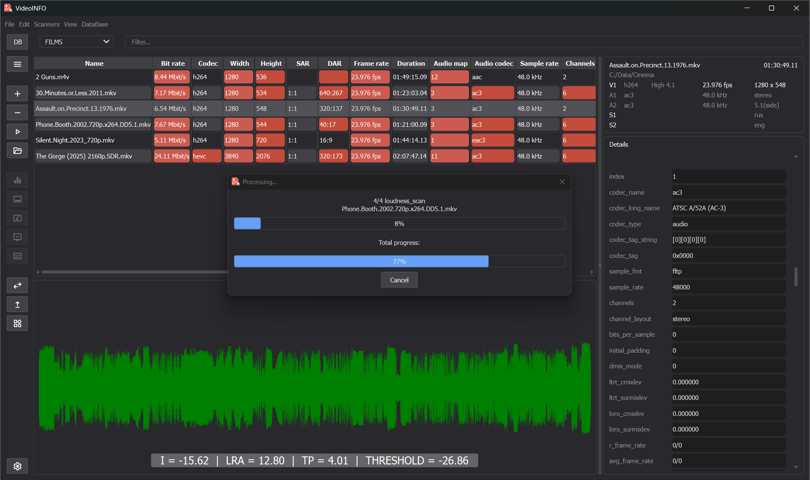

# VideoINFO

A batch video property scanner using the open-source `FFmpeg` library with a `PySide6` GUI. The tool extracts and displays video metadata in a tabular format, highlighting parameters that fall outside user-configured standards—making it easy to identify issues that require correction.  

**Key Features**:  
- **Comprehensive Metadata Analysis**: Resolution, aspect ratio, bitrate, framerate, frame-accurate duration, audio tracks (count/type), subtitles (title, tags, etc.).  
- **Broadcast & Streaming Focus**: Designed for TV broadcasters, streaming platforms, and media libraries with large-scale video collections needing pre-ingestion or pre-broadcast validation.  
- **Specialized Scanners**:  
  - **R128 Compliance**: Checks audio loudness against broadcast standards.  
  - **BlackScreen Detection**: Lists timestamps/durations of prolonged black frames.  
  - **Silence Detection**: Identifies audio silence/below-threshold segments.  
  - **Freeze Detection**: Flags frozen frames (unchanged video content).  
  - *All modes are configurable via threshold/duration settings.*  

### Target Users  
Media companies, broadcast engineers, and QC teams managing extensive video archives or live-streaming pipelines.  

### Current Status  
**Early Development** — Active improvements and fixes are underway. This project is a priority for me, born from years of experience in television and a long-held vision to streamline video QC.  

### Roadmap  
- Enhanced parameter coverage.  
- Improved performance for large batches.  
- User-friendly configuration (YAML/JSON presets).  
- Exportable reports (XLSX/CSV/HTML).

**Installation & Usage**
(Will be added as the project matures. FFmpeg dependency required.)

**Contribute**
Feedback, bug reports, and PRs are welcome! Let’s build a robust tool for the media industry.

**Why This Exists:**
After years in broadcast, I saw the need for an open-source, automated QC solution—so I built it.

*Tags: FFmpeg, video-analysis, broadcast, QC, streaming, media-tools*
